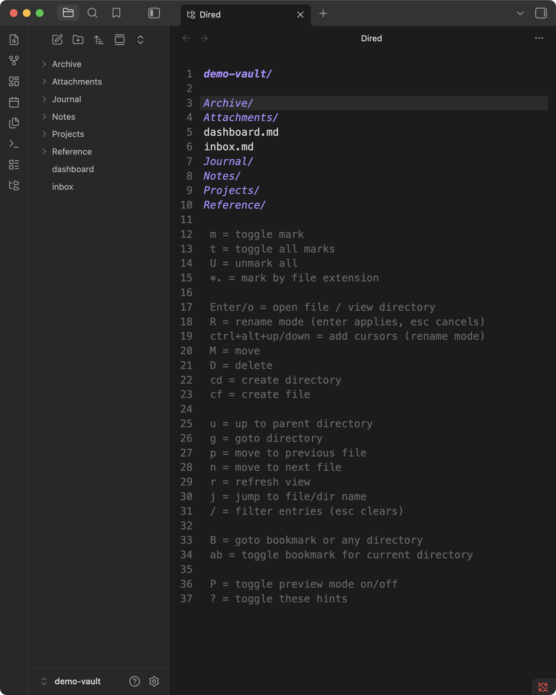

# Dired

A keyboard-driven file manager for Obsidian, modeled on [Dired](https://www.gnu.org/software/emacs/manual/html_node/emacs/Dired.html) from Emacs.

Dired shows a folder as a text buffer, one entry per line. Move the cursor to a file and press a key to open, mark, rename, move, or delete it. No mouse needed.



## Features

- **Marks.** Mark several files, then move or delete them together.
- **Rename in place.** Press `R`, edit names right in the buffer, and press `Enter`. Add cursors on neighboring lines to edit many names at once.
- **Links stay intact.** Renames and moves go through Obsidian, so links and embeds update automatically.
- **Native deletes.** Deleting uses Obsidian's own prompt and respects your trash settings.
- **Fuzzy filter.** Press `/` and type a few letters to narrow the listing.
- **Bookmarks.** Save folders you visit often and jump to them from anywhere.
- **Preview.** Show the file under the cursor in a split as you move through the list.
- **Always current.** The listing updates when files change, even from sync or other plugins.

## Getting started

Run **Dired: Open** from the command palette, click the folder-tree icon in the ribbon, or right-click a folder in the file explorer and choose **Open in dired**.

The key list at the bottom of the buffer covers everything. Press `?` to hide it once you know your way around.

For a full walkthrough, read the [user guide](USER-GUIDE.md).

## Keys

| Key | Action |
| --- | --- |
| `n` / `p` | Next / previous entry |
| `Enter` / `o` | Open file or folder |
| `u` | Up to parent folder |
| `g` | Go to any folder |
| `j` | Jump to an entry in this folder |
| `/` | Filter entries (`Esc` clears) |
| `r` | Refresh |
| `m` | Mark or unmark, then move down |
| `t` | Flip all marks |
| `U` | Clear all marks |
| `*` `.` | Mark by file extension |
| `R` | Rename mode (`Enter` applies, `Esc` cancels) |
| `Ctrl+Alt+↑` / `↓` | Add a cursor above / below (rename mode) |
| `M` | Move marked entries, or the one at the cursor |
| `D` | Delete marked entries, or the one at the cursor |
| `c` `d` | Create folder |
| `c` `f` | Create file |
| `a` `b` | Bookmark this folder, or remove the bookmark |
| `B` | Go to a bookmark or any folder |
| `P` | Preview mode on/off |
| `?` | Show or hide the key list |

Keys shown as two letters, like `c` `d`, are pressed one after the other.

## Settings

**Preview placement** chooses whether the preview opens to the right of dired or below it.

## Customization

Dired picks up your theme's monospace font, font size, and colors. To change the look, see [THEME.md](THEME.md).

## Installation

From Obsidian:

1. Open Settings → Community plugins → Browse.
2. Search for "Dired", then install and enable it.

Or [install it from community.obsidian.md](https://community.obsidian.md/plugins/dired).

Manually:

1. Download `main.js`, `manifest.json`, and `styles.css` from the [latest release](https://github.com/gapmiss/dired/releases/latest).
2. Put them in a new folder at `<your vault>/.obsidian/plugins/dired/`.
3. In Settings → Community plugins, reload the plugin list and enable Dired.

## Development

```bash
npm install
npm run dev     # rebuild on change
npm run build   # type-check and production build
npm run lint    # eslint with eslint-plugin-obsidianmd
```

See [CONTRIBUTING.md](CONTRIBUTING.md).

## License

[MIT](LICENSE)
